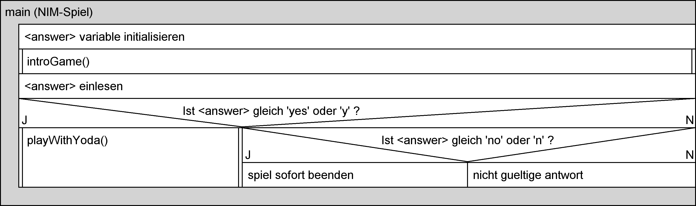
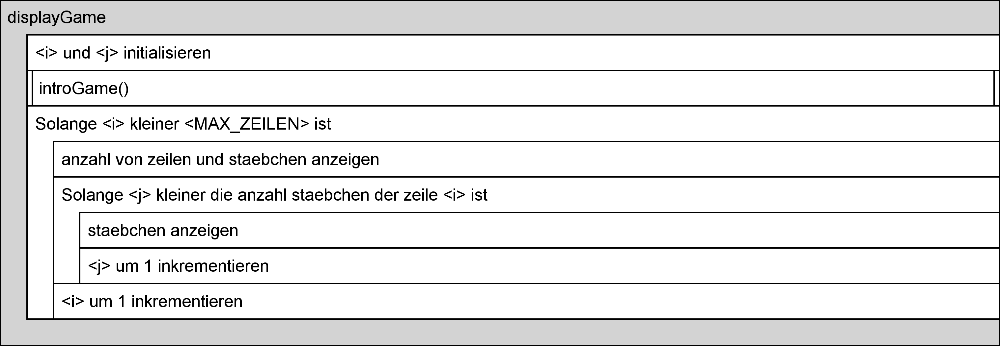
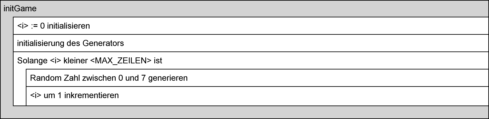
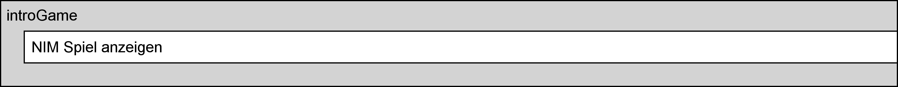
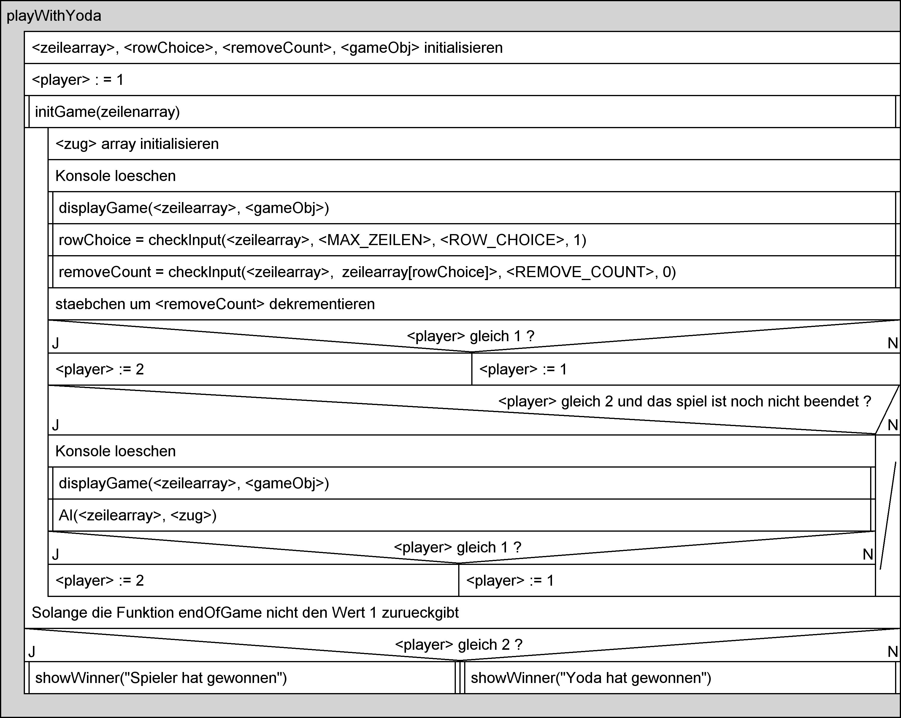
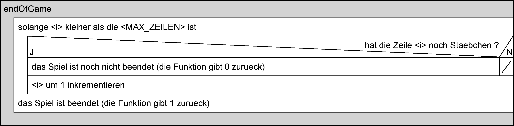
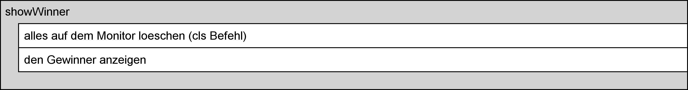
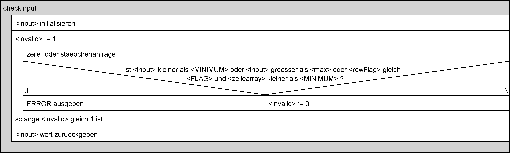
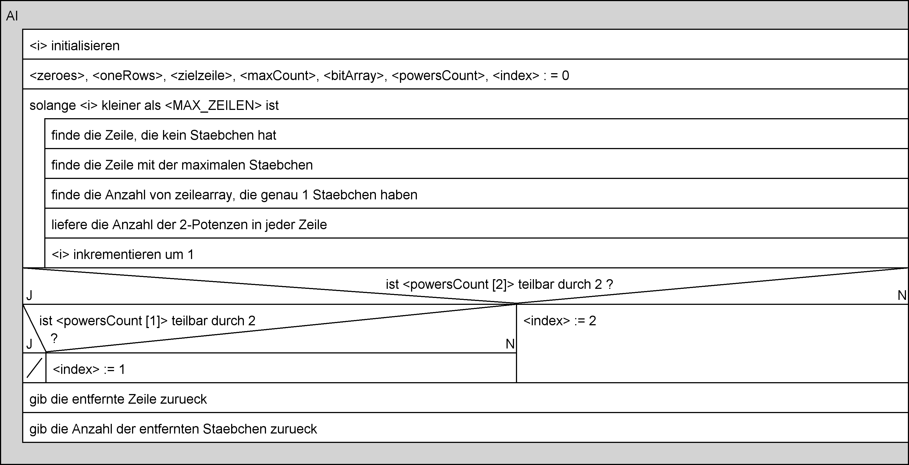

# Spiel NIM

## Einleitung

NIM ist ein Strategiespiel, das von zwei Spielern gespielt wird. Es werden Streichhölzer in mehreren Reihen angeordnet. Abwechslungsweise nehmen jetzt die Spieler Hölzchen weg. Ein Spieler muss ein oder mehrere Hölzchen nehmen. Es dürfen aber nur Hölzchen aus einer einzelnen Reihe genommen werden.

Derjenige Spieler, welcher das oder die letzten Hölzchen nehmen kann, hat gewonnen.

## Aufgabe

Ein NIM Spiel soll als Console-Applikation entwickelt werden. Dabei sollen diese Anforderungen berücksichtigt werden:

### Anforderungen

- Initialisierung des Spiels: Die Anzahl Reihen und Anzahl Hölzchen können entweder vom Benutzer eingegeben werden oder vom Programm zufällig erzeugt werden. Beide Varianten sind zulässig.
- Anzeige: Der aktuelle Stand (Anzahl Hölzchen pro Reihe) muss in verständlicher Form auf der Konsole angezeigt werden. Wenn das Spiel zu Ende ist, soll der Gewinner angezeigt werden.
- Spielverlauf: Der Spieler wechselt sich ab mit dem Computer. Wenn der Spieler an der Reihe ist, wird er über eine Meldung aufgefordert, seinen Zug zu machen.
- Benutzer-Spielzug: Der Benutzer kann eingeben, in welcher Zeile, wie viele Hölzchen entfernt werden sollen. Fehlerhafte Eingaben des Benutzers sollen das Programm nicht zum Abstürzen bringen.
- Computer-Spielzug: Der Computer kann einen gültigen Spielzug durchführen. Es kann (muss aber nicht, gibt aber Zusatzpunkte) eine [Gewinn-Strategie](https://www.hep-verlag.ch/pub/media/import/public/6486/mathematikaufgaben.pdf) implementiert werden. Vergl. Auch verschieden «Levels» sind denkbar.
- Korrektheit: Die Spielzüge müssen korrekt angewendet werden.
- Usability: Mit Hilfe der angezeigten Meldungen soll dem Benutzer klar sein, wie das Spiel zu benutzen ist.

## Vorgaben

### Header

Für die Implementierung des Spiels brauchen Sie vermutlich diese Header-Includes:

```c
#include <stdio.h>  /* Funktionsbibliothek: Standard Ein- Ausgabe */
#include <string.h> /* String Library */
#include <time.h> /* Initialisierung des Zufallsgenerators */
```

### User Input

Für das Lesen von Benutzereingaben können Sie die Funktion `scanf` verwenden. Ein Beispiel, wie diese Funktion verwendet wird, finden Sie in der nachfolgenden Abbildung.

Wenn Sie nur eine einzelne Zahl lesen wollen, können Sie diese Funktion verwenden.

## Vorgehen

### Analyse

- Zeichnen Sie ein UML Aktivitäts-Diagramm bzw. Struktogramm, welches den Ablauf und die einzelnen Schritte des Spiels zeigt. Überlegen Sie sich, welche Aktionen sie in weitere Aktionen aufteilen möchten.
- Überlegen Sie sich, welche Daten Sie brauchen, um den Zustand des Spiels festzuhalten.
- Definieren Sie eine Reihenfolge, in welcher Reihenfolge Sie die Funktionen implementieren und testen.
- Definieren Sie, wie/ob Sie die einzelnen Funktionen testen (z.B. Bei der Anzeigefunktion sehen sie sofort, wenn etwas nicht stimmt. Das könne Sie so festhalten und sagen, dass sie das nicht ausdrücklich testen)

#### Struktogramm











### Implementierung

- Definieren Sie für die alle Aktionen C-Funktionen

```c
void introGame();
void initGame(int *zeilearray);
void displayGame(const int *zeilearray, const char gameObj);
void playWithYoda();
int checkInput(const int *zeilearray, const int maxLimit, const char* msg, const int rowFlag);
short endOfGame(const int *zeilearray);
void showWinner(const char *winner);
void AI(int *zeilearray, int *zug);
```

- Definieren Sie geeignete Datenstrukturen
- Definieren Sie die entsprechenden Variablen, um den Spielstatus zu speichern.
- Implementieren und testen Sie die Funktionen gemäss Ihres Plans.

### Testen

Ich habe alle Schritte mit der Konsole geprüft, um alle Testfälle zu testen. Meine erste Idee war, dass der Code mit einem `yml-file` automatisch getestet werden könnte, aber aus zeitlichen Gründen was es nicht möglich.

### Source Code Verwaltung und Hilfestellungen

- Speichern Sie das Projekt mit git (github oder gitlab) und geben Sie mir Zugriff auf dieses Repository. Ich werde Kommentare, Anmerkungen u.U. Implementierungsvorschläge in einem Branch zu diesem Projekt machen.
- Teilen Sie mir mit, wenn Sie die Analyse abgeschlossen habe. Ich kann ihnen dann eine Rückmeldung dazu geben. Es ist aber normal, dass man während der Implementierung feststellt, dass eine Überlegung aus der Analyse so nicht funktioniert. Dennoch macht es Sinn, mit einer Analyse zu beginnen.
- Ich werde Sie bei der Lösung dieser Aufgabe unterstützen. Es sollen aber von ihnen klare eindeutige Fragen kommen.

## Bewertung

Bewertet wird die Erfüllung der Anforderungen 70% sowie die Analyse 30%. Die gesamte Arbeit ergibt eine Note mit Gewicht 40%.
